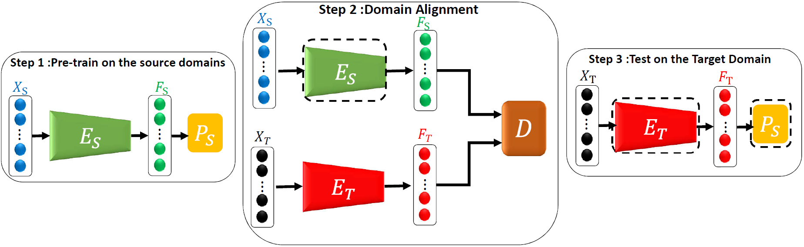

# Adversarial-Transfer-Learning-for-RUL
#### *by: Mohamed Ragab, Zhenghua Chen, Min Wu, Chee Keong Kwoh, and  Xiaoli Li*
#### IEEE International Conference on Prognostics and Health Management (ICPHM2020)

## Abstract

Remaining useful life (RUL) prediction is a key task for realizing predictive maintenance for industrial machines/assets. Accurate RUL prediction enables prior maintenance scheduling that can reduce downtime, reduce maintenance costs, and increase machine availability. Data-driven approaches have a widely acclaimed performance on RUL prediction of industrial machines. Usually, they assume that data used in training and testing phases are drawn from the same distribution. However, machines may work under different conditions (i.e., data distribution) for training and testing phases. As a result, the model performing well during training can deteriorate significantly during testing. Naive recollection and re-annotation of data for each new working condition can be very expensive and obviously not a viable solution. To alleviate this problem, we rely on a transfer learning approach called domain adaptation to transfer the knowledge learned from one labelled operating condition (source domain) to another operating condition (target domain) without labels. Particularly, we propose a novel adversarial domain adaption approach for remaining useful life prediction, named ADARUL, which can work on the data from different working conditions or different fault modes. This approach is built on top of a bidirectional deep long short-term memory (LSTM) network that can model the temporal dependency and extract representative features. Moreover, it derives invariant representation among the working conditions by removing the domain-specific information while keeping the task-specific information. We have conducted comprehensive experiments among four different datasets of turbofan engines. The experiments show that our proposed method significantly outperforms the state-of-the-art methods.

### Dependencies
This code requires the following:
* python 2.\* or python 3.\*
* Pytorch v1.2+
* TensorboardX
* Plotly

### Data
The model performance is tested on NASA turbofan engines dataset [https://ti.arc.nasa.gov/tech/dash/groups/pcoe/prognostic-data-repository/#turbofan]. 

### Data Preprocessing
After downloading you can do the data preprocessing steps you can check this file `data_processing.py`

### Usage
- To run the code, we have tried the model using two optimizers, SGD with momentum `Final_SGD.py` and Adam optimizer `Final_Adam.py. The files will show the training results and then print the performance on test set.
- You can also visualize the tensorboard results, using the notebook of `Results Visualization.ipynb`
- Our reported results are based on 5 consecutive runs with calculating the mean and STD. 

